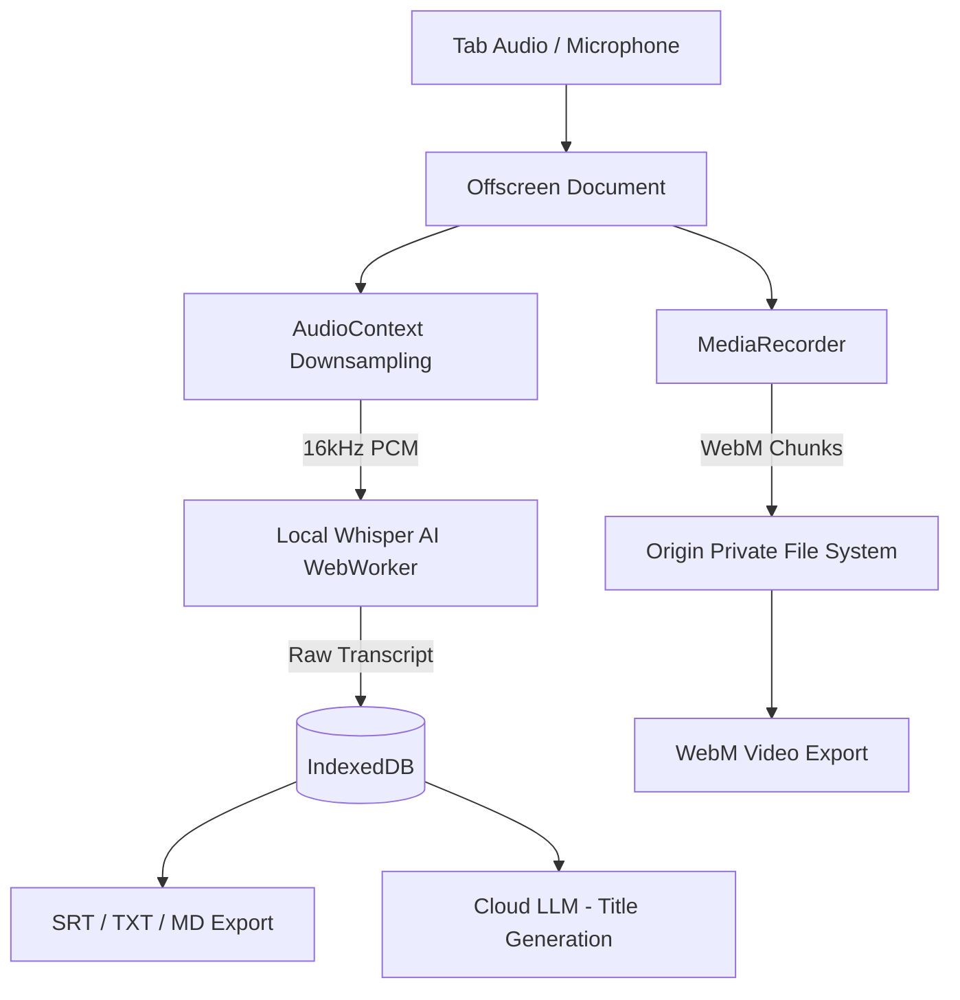

# SilentScribe

SilentScribe is a privacy-first, local Chrome Extension designed to record and transcribe browser audio directly on your device. By running the Whisper AI model entirely in the browser using WebAssembly, your raw meeting audio never leaves your machine. Cloud LLM integrations are used strictly to generate lightweight metadata, such as meeting titles and platforms.

## Architecture

The extension leverages an Offscreen Document to bypass Manifest V3 limitations, allowing access to DOM and Media APIs that are otherwise unavailable in standard Service Workers.

## Core Features

- **Tab and Microphone Audio Capture**: Utilizes `chrome.tabCapture` to intercept high-quality system audio directly from the active tab without relying on external microphones.
- **Local Transcription**: Uses Transformers.js to run Whisper locally on the device, ensuring sensitive meeting data is never sent to a third-party transcription server.
- **AI-Generated Metadata**: Connects to the NVIDIA NIM API (Llama 3 70B) to intelligently parse transcripts and automatically generate concise meeting titles and identify platforms.
- **Universal Exports**: Supports downloading raw video (WebM), SubRip Subtitles (SRT), Plain Text (TXT), Markdown (MD), and JSON formats.
- **High-Performance Storage**: Leverages the Origin Private File System (OPFS) to stream massive video files directly to the local disk, preventing browser memory exhaustion during long meetings.

## Installation

1. Clone the repository to your local machine.
2. Open Google Chrome and navigate to `chrome://extensions/`.
3. Enable "Developer mode" by toggling the switch in the top right corner.
4. Click the "Load unpacked" button.
5. Select the `silentscribe` directory from your cloned repository.
6. The extension is now installed. Pin it to your toolbar for easy access.

## Technical Stack

- **Framework**: Native Manifest V3 Chrome Extension API
- **AI Runtime**: Transformers.js (ONNX Runtime Web)
- **Audio Processing**: MediaStream & AudioContext API
- **Storage**: IndexedDB (Metadata) & OPFS (Binary Media)
