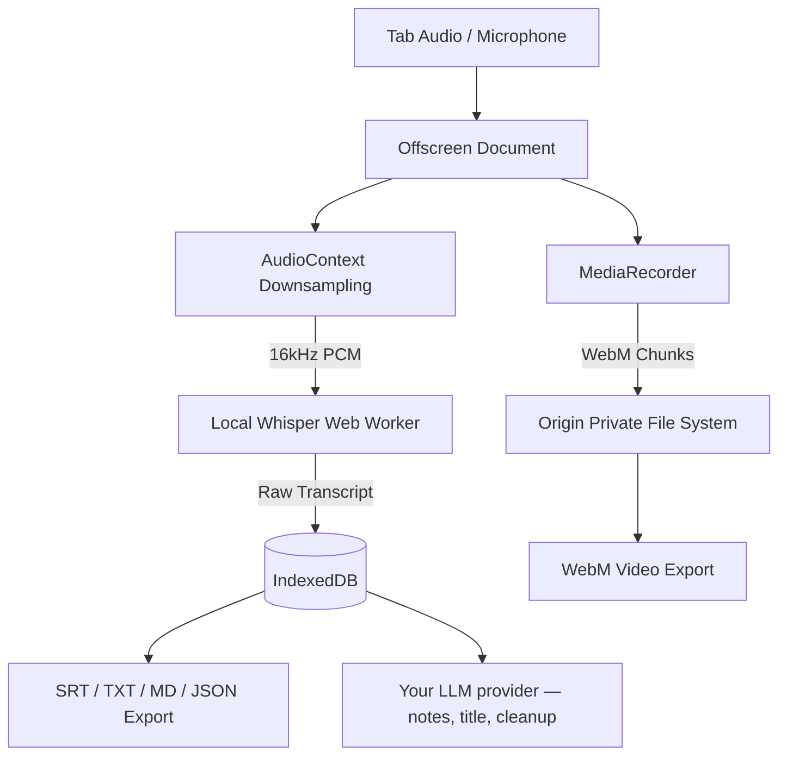

# SilentScribe

A privacy-first Chrome extension that records browser audio and transcribes it on your own machine. Whisper runs locally through WebAssembly, so raw meeting audio never leaves your computer. Only transcript **text** is sent to a language model, only for notes, titles and cleanup, and only when you ask for it.

## Architecture

An Offscreen Document works around Manifest V3's limits, giving access to the DOM and Media APIs that a service worker cannot reach.


```mermaid
graph TD
    A[Tab Audio / Microphone] --> B[Offscreen Document]
    B --> C[MediaRecorder]
    B --> D[AudioContext Downsampling]

    C -->|WebM Chunks| E[Origin Private File System]
    D -->|16kHz PCM| F[Local Whisper Web Worker]

    F -->|Raw Transcript| G[(IndexedDB)]

    E --> H[WebM Video Export]
    G --> I[SRT / TXT / MD / JSON Export]
    G --> J[Your LLM provider — notes, title, cleanup]
```

## Features

- **Tab and microphone capture** — `chrome.tabCapture` takes meeting audio straight from the tab. The microphone is recorded as a separate track, which is what makes the "Me" and "Others" split in the transcript exact rather than guessed.
- **Local transcription** — Transformers.js runs Whisper on your device. Audio is never uploaded to a transcription service.
- **Watch immediately** — stopping a recording opens it for playback right away. Transcription runs behind the video and drops in when ready. You can also stop without transcribing at all, and transcribe later from the recording.
- **Bring your own key** — notes, titles and transcript cleanup work with OpenAI, Anthropic, Google Gemini, NVIDIA NIM, Groq, OpenRouter, Mistral, DeepSeek, xAI, Together, Ollama, LM Studio, or any OpenAI-compatible endpoint. Chrome's on-device Gemini Nano works with no key at all.
- **Exports** — WebM video, SRT, TXT, Markdown, JSON.
- **OPFS storage** — long recordings stream to disk instead of filling memory.

## Install

```bash
git clone https://github.com/hemalbadola/silentscribe.git
cd silentscribe
./setup.sh
```

`setup.sh` installs Transformers.js and copies the library plus the ONNX Runtime WebAssembly binaries into `lib/`. **Do not skip it.** Without those binaries the runtime downloads ~10MB from a CDN on every cold start, so transcription needs the network and fails whenever the CDN is unreachable.

Then:

1. Open `chrome://extensions/`
2. Turn on **Developer mode**
3. **Load unpacked** and pick the `silentscribe` directory
4. Pin the extension and open the side panel

The first transcription downloads a speech model of roughly 145MB. It is slow once, then cached.

## Setting up notes

**No API key ships with this extension**, by design. A key inside an extension is readable by anyone who installs it, and it appears in the network panel of every machine that runs it, so there is no way to bundle one and keep it secret.

Open the side panel, then **Settings → Meeting Notes Engine**:

1. Pick a provider.
2. Paste your key. It stays in this Chrome profile and is sent only to the provider you chose.
3. Press **Load models** to list what your key can actually reach, and pick one.
4. Press **Test connection**.

Notes generation is a map-reduce over the transcript, so a long meeting is several sequential calls. A small fast model beats a large one here.

For no key at all, choose **Chrome built-in (Gemini Nano)**. It runs on-device and is free, but its context is small, so long meetings are summarised in many more passes.

## Diagnostics

**Settings → Diagnostics → Run checks** reports the live state of every part that can fail: extension version, keyboard shortcut binding, microphone permission, speech model, whether both `lib/` runtime files are present, the notes provider and where its settings came from, managed-config freshness, and storage usage. **Copy report** puts it on the clipboard for a bug report.

Errors elsewhere in the panel say what broke, why, and the single next step, with the raw message folded into a "Technical detail" block.

## Team defaults and update notices (optional)

An install can poll a JSON file you host and pick up provider defaults, a version number and notices. See `config.sample.json`. Point `DEFAULT_CONFIG_URL` in `utils/remote-config.js` at its raw URL, or set `SILENTSCRIBE_CONFIG_URL` in `.claude/.env`.

**No key travels through this file**, and the extension ignores one if present. It saves your team typing a provider and model, nothing more.

Chrome does not auto-update an unpacked extension — only Web Store installs and enterprise-policy `.crx` installs update themselves. The `version` and `downloadUrl` fields drive an in-panel banner telling people a newer build exists; installing it stays manual.

## Development

```bash
npm run check     # static checks — syntax, imports, DOM ids, CSS tokens, manifest, secrets
npm test          # test suites
```

`npm run check` catches what a browser only reports at runtime: a syntax error, an import of a renamed export, an element id the panel looks up but the HTML does not define, an undefined CSS custom property, a manifest pointing at a missing file, and anything shaped like an API key in a file that would be packaged. It has no dependencies.

### Chrome APIs are not available everywhere

The same `chrome.*` call is correct in one file and a crash in another, and nothing in JavaScript says so. `npm run check` walks the import graph from each entry point — through `await import(...)` as well as static imports — and fails on any call the context does not have:

| Context | Gets |
| --- | --- |
| `background/service-worker.js` | everything the manifest permits |
| `sidepanel/*` | everything the manifest permits |
| `offscreen/offscreen.js` | **`chrome.runtime` only** |
| `content/content.js` | `chrome.runtime`, `chrome.storage`, `chrome.i18n` |
| `transcription/transcription-worker.js` | **nothing** |

The offscreen document is the trap. It has the full DOM and every media API, so it feels like an ordinary page, but `chrome.storage` is undefined there. Anything it needs from storage is requested from the service worker with `MSG.OFFSCREEN_GET_SETTINGS`. A util shared with the side panel has to obey the offscreen limit too, which is why the check follows imports rather than reading one file.

## Stack

- Manifest V3, no framework, no bundler — plain ES modules loaded by Chrome
- Transformers.js on ONNX Runtime Web, pinned to a single thread (the multi-threaded backend builds its worker from a `blob:` URL, which the MV3 content security policy blocks)
- MediaStream and AudioContext for capture
- IndexedDB for metadata, OPFS for media
